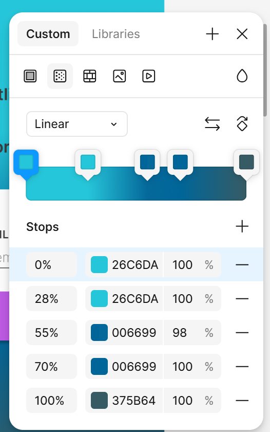

# Farben in OYN

## Textfarben

| Semantischer Name | Palette   | Shade | Zweck                    |
|-------------------|-----------|-------|--------------------------|
| text.primary      | secondary | 500   | Standard-Fließtext       |
| text.secondary    | secondary | 400   | Meta-Infos, Labels       |
| text.disabled     | secondary | 300   | Disabled Text            |
| text.inverse      | secondary | 50    | Text auf dunklem BG      |
| text.heading      | secondary | 700   | Überschriften            |
| text.link         | primary   | 600   | Links                    |
| text.link-hover   | primary   | 700   | Hover-Zustand            |

## Surface/ Background (Schreibfläche)
| Semantischer Name | Palette   | Shade | Zweck                |
|-------------------|-----------|-------|----------------------|
| surface.page      | secondary | 50    | Seitenhintergrund    |
| surface.card      | secondary | 100   | Karten               |
| surface.panel     | secondary | 200   | Panels, Inputs       |
| surface.overlay   | secondary | 50    | Modals               |
| surface.disabled  | secondary | 200   | Disabled BG          |

## Border / Divider
| Semantischer Name | Palette   | Shade | Zweck                   |
|-------------------|-----------|-------|--------------------------|
| border.default    | secondary | 300   | Standard-Rahmen          |
| border.subtle     | secondary | 200   | Sehr leichte Trennung    |
| border.focus      | primary   | 500   | Fokus-Rand               |
| border.error      | warn      | 500   | Fehler                   |

## Action / Buttons
| Semantischer Name   | Palette   | Shade | Zweck             |
|---------------------|-----------|-------|-------------------|
| action.primary      | primary   | 500   | Hauptaktion       |
| action.primary-hover| primary   | 600   | Hover             |
| action.primary-active| primary  | 700   | Active            |
| action.accent       | accent    | 500   | Sekundäre Aktion  |
| action.accent-hover | accent    | 600   | Hover             |
| action.disabled     | secondary | 300   | Disabled          |

## Status / Feedback
| Semantischer Name | Palette | Shade | Zweck                 |
|-------------------|---------|-------|-----------------------|
| status.error      | warn    | 500   | Fehler                |
| status.error-bg   | warn    | 50    | Error-Hintergrund     |
| status.warning    | warn    | 600   | Warnung               |
| status.info       | primary | 500   | Info                  |
| status.success    | primary | 400   | Erfolg (dezent!)      |

## Fokus und Selektion
| Semantischer Name | Palette   | Shade | Zweck            |
|-------------------|-----------|-------|------------------|
| focus.ring        | primary   | 400   | Fokus-Indikator  |
| selection.bg      | primary   | 100   | Textauswahl      |
| selection.text    | secondary | 700   | Textauswahl      |

# Palettes
## Blue Ocean

```js
$blue-ocean--primary: mat.m2-define-palette((
  50:  #e1f2f7,
  100: #b3e0ec, 
  200: #80cce0,   
  300: #4db8d3,
  400: #26a9c9,
  500: #006699,
  600: #005d8a,
  700: #005078,
  800: #004366,
  900: #002E4D,
  contrast: (
    50:  rgb(58, 58, 58),
    100: rgb(58, 58, 58),
    200: rgb(58, 58, 58),
    300: rgb(58, 58, 58),
    400: rgb(58, 58, 58),
    500: #fff,
    600: #fff,
    700: #fff,
    800: #fff,
    900: #fff
  )
), 500);
```

```js
$blue-ocean--accent: mat.m2-define-palette((
  50:  #f4e6fa,
  100: #e4c1f3,
  200: #d399ec,
  300: #c271e5,
  400: #b857e0,
  500: #bf5be6,
  600: #aa4fd0,
  700: #9446b8,
  800: #7e3d9f,
  900: #5c2b75,
  contrast: (
    50:  rgb(58, 58, 58),
    100: rgb(58, 58, 58),
    200: rgb(58, 58, 58),
    300: rgb(58, 58, 58),
    400: rgb(58, 58, 58),
    500: #ffffff,
    600: #ffffff,
    700: #ffffff,
    800: #ffffff,
    900: #ffffff
  )
), 500);
```

```js
$blue-ocean--warn: mat.m2-define-palette((
  50:  #fdecea,
  100: #f9c6c1,
  200: #f39e98,
  300: #ec766f,
  400: #e6554d,
  500: #d32f2f,
  600: #c62828,
  700: #b71c1c,
  800: #9f1717,
  900: #7f1010,
  contrast: (
    50:  rgb(58, 58, 58),
    100: rgb(58, 58, 58),
    200: rgb(58, 58, 58),
    300: rgb(58, 58, 58),
    400: rgb(58, 58, 58),
    500: #ffffff,
    600: #ffffff,
    700: #ffffff,
    800: #ffffff,
    900: #ffffff
  )
), 500);
```

## Secondary palette

| Shade   | Hex-Code   | Zweck                |
|---------|------------|--------------------- |
| 50      | #FFFFFF  | Page/ App Background |
| 100     | #F5F5F5  | Cards, leichte Flächen |
| 200     | #E0E0E0  | Input-Hintergründe |
| 300     | #C8C8C8  | Divider, Disabled BG |
| 400     | #9E9E9E  | Disabled Text |
| 500     | #3A3A3A | Primary Text |
| 600     | #2F2F2F | Strong Text |
| 700     | #242424 | Headings |
| 800     | #1A1A1A | sehr dunkle Akzente |
| 900     | #0F0F0F | fast schwarz (selten!) |

```js
$blue-ocean--secondary: mat.m2-define-palette((
  50:  #ffffff,
  100: #f5f5f5,
  200: #e0e0e0,
  300: #c8c8c8,
  400: #9e9e9e,
  500: #3a3a3a,
  600: #2f2f2f,
  700: #242424,
  800: #1a1a1a,
  900: #0f0f0f,
  contrast: (
    50:  rgb(58, 58, 58),
    100: rgb(58, 58, 58),
    200: rgb(58, 58, 58),
    300: rgb(58, 58, 58),
    400: rgb(58, 58, 58),
    500: #ffffff,
    600: #ffffff,
    700: #ffffff,
    800: #ffffff,
    900: #ffffff
  )
), 500);
```


## Bilder
Farbverlauf auf Startbildschirm: <br>
